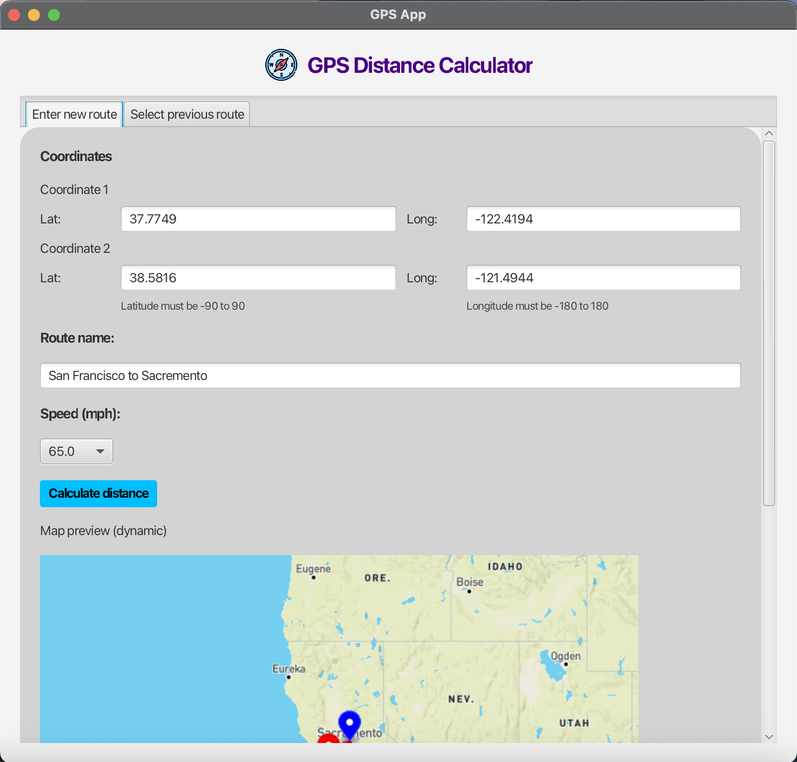
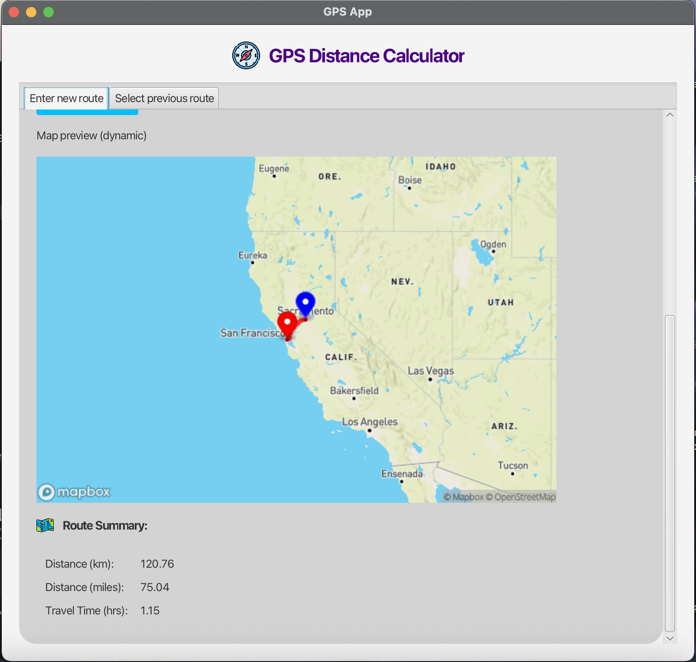
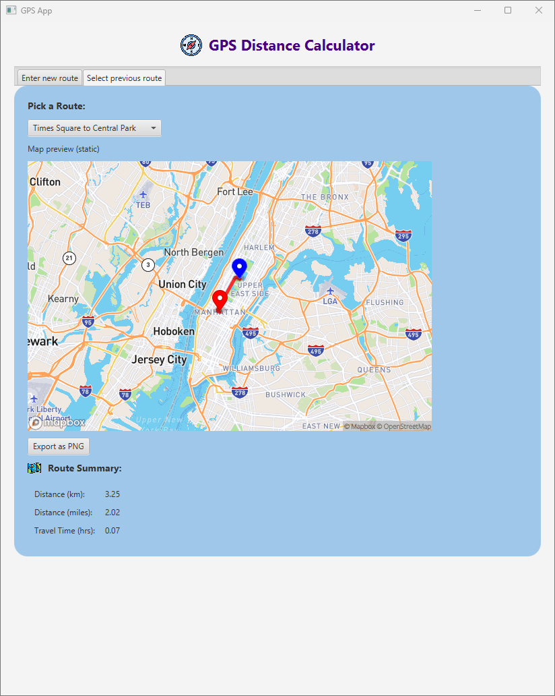

# GPS Distance Calculator (Java)

A Java/JavaFX application that calculates distances between coordinates, estimates travel time, and renders real routes dynamically using the Mapbox Directions + Static Maps API. Includes persistent route storage, a clean UI, and full CLI support.

---

## 🌟 Features

- Dynamic Route Mapping
   - Draws real driving routes between two coordinates using Mapbox's Directions API
   - Visualizes the route using Mapbox Static Maps
   - Automatically encodes & draws polylines
   - Auto-adjusting zoom level for long vs. short routes

- Interactive JavaFX GUI
   - Enter coordinates, route names, and speeds
   - Live-updating map preview
   - Saved routes dropdown now regenerates the map dynamically
   - Route summary includes:
      - Distance (km & miles)
      - Travel time
      - Selected speed
   - Export the current map preview as a PNG from either tab (FileChooser dialog; `.png` extension appended automatically if omitted)

- Route Persistence
   - Saved to saved_routes.json
   - Overwrite/rename/duplicate detection
   - Loads instantly into the GUI on startup

- CLI Mode
   - Fast terminal-based route calculation
   - Same distance + travel time logic as GUI

- Clean OOP Architecture
   - Location
   - Route
   - RouteLoader
   - MapboxService (handles API calls + polyline encoding)

---

## 📸 Screenshots






---

## 📦 Dependencies

- Java 21+
- JavaFX 21+ (modules: `controls`, `fxml`, `web`, `swing`)
- [`org.json`](https://github.com/stleary/JSON-java) library (included in `lib/`)
- Gradle 8.14.3
- Mapbox API Token (required)

---

## 🔑 Environment Setup (Mapbox)

This app requires a Mapbox Directions API token: 
1. Create a free Mapbox account
2. Generate a public access token
3. Create a file at:
```bash
src/main/resources/config.properties
```
4. Do not commit this file. A template config.properties.example is provided.


---

## 🔧 How to Run GUI

1. Make sure Java and Gradle are installed:
   ```bash
   java -version
   gradle -version
2. Next run gradle build:
   ```bash
   gradle build
3. Then run:
   ```bash
   gradle run
---

## 🔧 How to Run CLI

1. Make sure Java and Gradle are installed:
   ```bash
   java -version
   gradle -version
2. Next run gradle build:
   ```bash
   gradle build
3. Then run:
   ```bash
   gradle runCli --console=plain

---
## 🧩 Coming Soon (Future Enhancements)
- Support for multi-waypoint routes
- User-clickable map for coordinate selection
- Dark-mode map styles
- Auto-detect city names / reverse geocoding