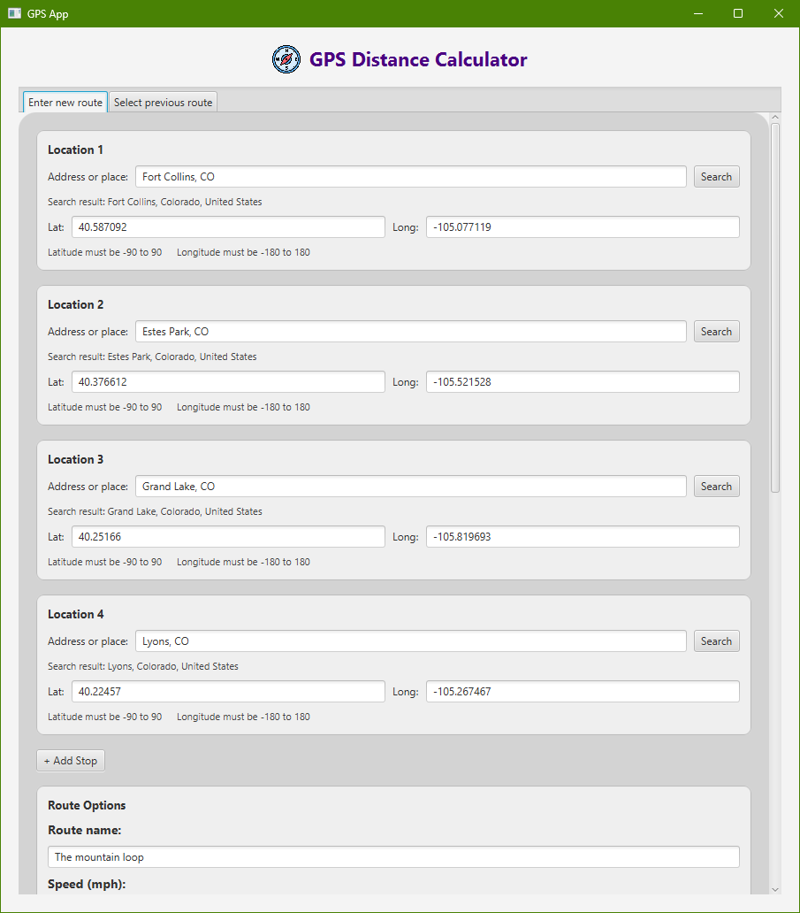
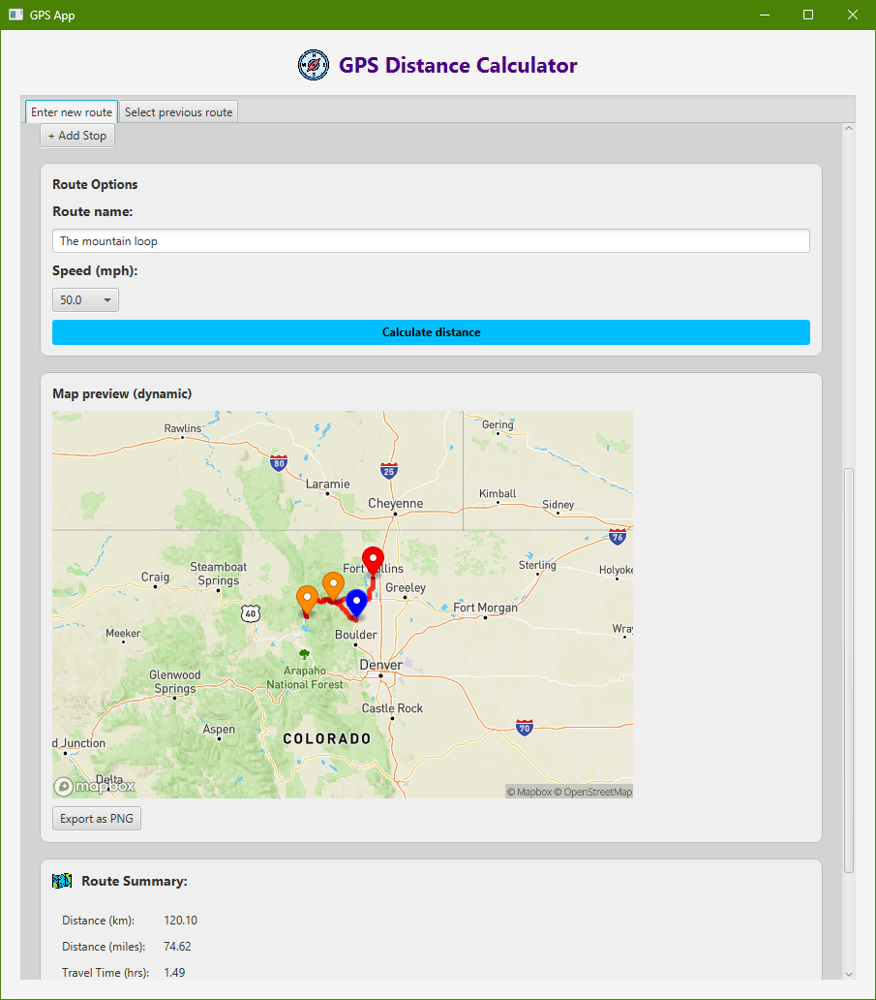
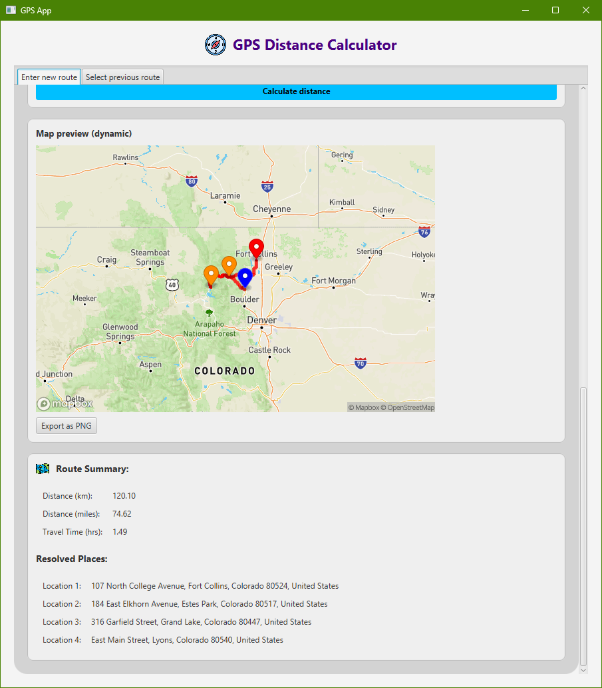
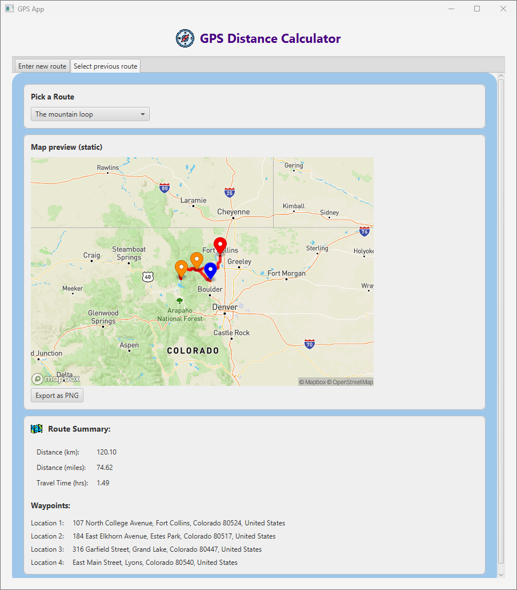

# GPS Distance Calculator (Java)

A Java/JavaFX application that calculates distances along multi-waypoint routes, estimates travel time, and renders real driving routes dynamically using the Mapbox Directions + Static Maps API. Supports routes with 2 or more stops. Includes persistent route storage, a clean UI, and full CLI support.

---

## 🌟 Features

- Dynamic Route Mapping
   - Draws real driving routes through 2 or more coordinates using Mapbox's Directions API
   - Visualizes the route using Mapbox Static Maps with color-coded pins (red start, orange stops, blue end)
   - Automatically encodes & draws polylines
   - Auto-adjusting zoom level based on the bounding box of all waypoints

- Interactive JavaFX GUI
   - Enter coordinates directly or search by address or place name; address search uses the Mapbox Geocoding API and populates the latitude and longitude fields automatically
   - Resolved place name shown below each search field immediately after Search (e.g., `"Search result: Red Rocks Amphitheatre, Morrison, Colorado"`); latitude and longitude fields remain directly editable and are always the source of truth for Calculate
   - Card-based layout groups related controls into distinct visual sections: location inputs, route options, map preview, and route output
   - Click "+ Add Stop" to add additional waypoint cards (Location 3, Location 4, …); each card has its own address search and lat/lon fields
   - Calculate uses all location cards in order; total distance is the sum across all legs
   - Live-updating map preview
   - Saved routes dropdown regenerates the map dynamically; waypoint names are listed in the output card
   - Route summary includes:
      - Distance (km & miles)
      - Travel time
      - Selected speed
   - Export the current map preview as a PNG from either tab (FileChooser dialog; `.png` extension appended automatically if omitted)
   - After Calculate, reverse geocoding identifies canonical place names for all waypoints; results appear in a "Resolved Places" section

- Route Persistence
   - Saved to saved_routes.json
   - All waypoints (not just start and end) stored with reverse-geocoded place names
   - Overwrite/rename/duplicate detection (compares all waypoints)
   - Loads instantly into the GUI on startup; multi-waypoint routes display correctly in the Previous Route tab

- CLI Mode
   - Fast terminal-based route calculation
   - Same distance + travel time logic as GUI

- Clean OOP Architecture
   - Location
   - Route
   - RouteLoader
   - MapboxService (handles Directions, Static Maps, and Geocoding API calls)

---

## 📸 Screenshots









---

## 📦 Dependencies

- Java 21+
- JavaFX 21+ (modules: `controls`, `fxml`, `web`, `swing`)
- [`org.json`](https://github.com/stleary/JSON-java) library (included in `lib/`)
- Gradle 8.14.3
- Mapbox API Token (required)

---

## 🔑 Environment Setup (Mapbox)

This app requires a Mapbox Directions API token: 
1. Create a free Mapbox account
2. Generate a public access token
3. Create a file at:
```bash
src/main/resources/config.properties
```
4. Do not commit this file. A template config.properties.example is provided.


---

## 🔧 How to Run GUI

1. Make sure Java and Gradle are installed:
   ```bash
   java -version
   gradle -version
2. Next run gradle build:
   ```bash
   gradle build
3. Then run:
   ```bash
   gradle run
---

## 🔧 How to Run CLI

1. Make sure Java and Gradle are installed:
   ```bash
   java -version
   gradle -version
2. Next run gradle build:
   ```bash
   gradle build
3. Then run:
   ```bash
   gradle runCli --console=plain

---
## 🧩 Coming Soon (Future Enhancements)
- User-clickable map for coordinate selection
- Dark-mode map styles
